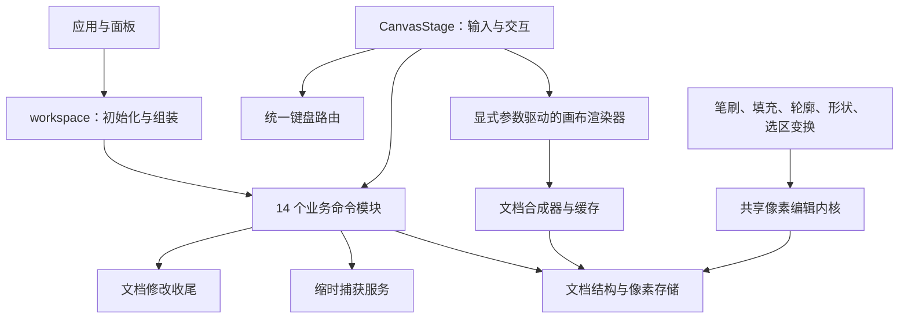

# 编辑器解耦契约

本次重构按职责迁移实现，同时收窄依赖和通知范围。原有文档格式、撤销条目和工具算法保持兼容。

## 模块边界

### Store

- `store/workspace.ts` 只组装状态、业务命令和异步录制完成通知。
- `workspace-commands-*` 分别负责会话、切片、工具、颜色、视图与选区、历史、瓦片、自由瓦片、动画、图层、剪贴板、文件 IO、恢复和应用提示。
- `WorkspaceCommandContext<Commands, Services>` 显式列出一个领域可以调用的其他命令和服务。业务模块不能导入根 Store，也不能通过 `set` 替换整个 Store、覆盖命令。
- 删除 `workspace-command-support.ts`。动画选择、动画蒙版槽、浮动预览、文本栅格、瓦片选择、自由瓦片提交、导出冲突分别有直接入口；颜色和工具命令使用翻译或会话查找时不再顺带加载恢复与事务注册服务。
- 恢复服务和文档事务注册表由 `createWorkspaceServices()` 创建，根 Store 将同一实例注入需要它们的命令。领域模块不自行创建全局单例。
- 图层命令入口只组装创建、文字、结构、选择、蒙版、属性和调色七个流程，每个流程声明自己的跨命令依赖。文字草稿由文字命令实例内的 `WeakMap<DocumentSession, ...>` 持有，关闭文档后不因草稿表继续保留文档快照。
- `workspace-mutation.ts` 统一状态修正、动画同步、内容失效、记录和界面版本更新。`ui`、`metadata`、`content`、`content-and-animation` 保留原有区别。旧 `mutateActive` 参数是兼容接口，实际收尾使用具名选项。
- `workspace-document-change.ts` 统一已应用变更的 dirty、内容失效和录制通知顺序，供 mutation 和直接提交路径共用。它不承诺原子回滚；历史条目构建及预览回滚仍由对应事务拥有，不能在 `mutateActive` 内重复执行完成通知。
- `workspace-recording.ts` 每个实例独立持有任务、缓存、取消代次和诊断队列。异步任务通过回调报告记录完成，不读取全局 Store。保存等待队列，关闭和重置取消旧代次。

### 文档与算法

- `core/document-model.ts` 管文档结构、像素存储、内容边界与存储版本；不依赖合成器。
- `core/document-composite.ts` 保留合成公开入口；计划、蒙版组合、样式缓存、区域合成和颜色采样由 `document-composite-*` 职责模块实现，详见[领域模块定位索引](architecture/domain-modules.md)。
- `core/document.ts` 保留旧导出入口；生产代码直接引用实际职责模块，底层实现不得回导入兼容入口。
- 工具拆成笔刷、填充、轮廓、形状、选区变换和合成采样模块。共享 `tools-pixel-edit.ts` 不依赖合成器或具体工具。
- `LayerMoveState` 由核心移动契约定义，画布拖拽状态扩展它。Store 不再从画布拖拽大状态中挑选字段。
- `shared/types-*.ts` 按色彩、栅格、笔刷、图层、动画、文档、文本、瓦片、选区、视图、缩时及平台协议等领域持有契约；生产代码直接引用所属契约。`shared/types.ts` 仅兼容旧入口，不再定义领域类型。分型不等于缩小 `SpriteDocument` 本身的职责，也不意味着原先任意字段变化都会影响所有入口消费者。
- `locales/contracts.ts` 持有翻译类型，`core/shortcut-contracts.ts` 持有快捷键 ID、默认值及分组契约。各语言 catalog 不再反向引用翻译实现，快捷键标签引用独立 ID 契约。`locales/shortcut-labels.ts` 提供展示入口，快捷键匹配不加载语言目录；标签生成仍单向依赖同步翻译实现。

### 画布与通知

- `canvas-render-frame.ts` 通过显式的绘制资源、设置、几何函数和会话读取回调绘制一帧，不订阅全局 Store。
- `canvas-keyboard-router.ts` 只注册一组原生键盘监听。普通按键发送给活动画布；切换文档后仍释放原画布的快捷键；非活动画布仅同步修饰键状态。
- `canvas-touch-navigation.ts` 独立持有触点集合和双指手势快照，管理单指/双指切换、取消及重置。画布只提供视图预览和单指平移接口，控制器不读取 Store 或修改文档。
- `EditorCanvasHost` 订阅文档列表、名称和修改标记。每个 `DocumentCanvas` 独立订阅自己的状态，避免一次文档操作让所有驻留画布重新执行组件逻辑。
- Session 是原地修改的对象，不能只用其引用做浅比较。`uiRevision` 专门通知工具、视图和其他界面变化，不能代替像素缓存使用的 `revision` / `contentRevision`。
- 绕过统一 mutation 的命令必须显式发布界面变化；目前包括工具同步、共享颜色、直接视图更新和独立历史提交。

### 应用与图层栏

- 应用退出由 `workspace-close-coordinator.ts` 处理重入、脏文档确认、恢复文件和历史写入等待。标签关闭与应用退出共用保存失败/取消决策规则。
- 图层栏的时间轴布局、缩略图缓存和订阅、选中行解析分别有独立模块。
- `LayerPropertyEditor` 独立持有表单、预览合并计时器和事务句柄。面板只传递目标 ID 并调用打开/关闭；重新打开先取消旧预览，卸载取消事务，关闭完成一次历史提交。

### 三个主组件的状态所有权（整体拆分）

| 组件 | 本轮开始 → 当前文件行数 | 当前最大函数行数 | 当前直接 useRef / useState / useEffect |
| --- | --- | --- | --- |
| CanvasStage | 7509 → 1523 | 1452 | 9 / 0 / 2 |
| LayersPanel | 2651 → 1188 | 1156 | 6 / 1 / 6 |
| App | 1827 → 927 | 880 | 0 / 3 / 3 |

更早的治理起点分别为 8347、3729、2991 行。本表使用 TypeScript AST 统计函数与直接 Hook 调用，文件按最终格式统计；多行 JSX 和显式依赖组装仍计入入口函数。提取后的 Hook 仍在 React 渲染过程中执行，直接 Hook 数下降不代表总状态数量或渲染成本下降，也不证明性能提升。

- **CanvasStage 是组装入口**：视口几何、选区变换、图层反馈、文本/尺寸预览、笔触时钟、设备路由、键盘和颜色采样有各自的 Hook 所有者。保留的 ref 主要用于 DOM 与绘制回调。各所有者通过显式依赖连接；延迟 getter 避免把初始化顺序变成事件期访问限制，不提供统一的可变 controller/context 大包。
- **工具输入按操作分派**：down/move/up 三个路由维护原有优先级，各工具模块负责导航、选区、文字、形状、普通笔触、瓦片、自由瓦片、填充等操作。每次调用只传入本次事件所需局部值。分支返回值表示是否消费事件，保留原来的提前返回语义。取色回调用 readSession 读取按下流程中可能重新指定的会话，避免闭包取到旧目标和旧颜色。
- **资源由创建者清理**：渲染引擎取消自己的重绘 RAF；选区变换取消自己的预览 RAF；笔触时钟停止喷枪和液化；选区覆盖层持有自己的动画 timeout。视口监听的卸载不再负责取消其他模块的任务。取色放大镜继续拥有预览、颜色队列和提交/取消语义。
- **画布渲染按阶段拆分**：canvas-render-frame 保留绘制计划、顺序和帧发布协调；背景、内容、选区、渐变、笔刷、瓦片、参考线和发布各有专用输入。通道不导入整份 CanvasRenderContext，也不访问根 Store。点击闪烁仍在实际呈现之后启动计时。总调度契约仍较宽，不能将局部通道的拆分称为所有渲染依赖已经消失。
- **LayersPanel 是栏目组装入口**：偏好、选择指示、可见性/锁定手势、行拖动、时间轴手势、快捷键与文件拖入分别管理状态。图层菜单和时间轴菜单各自拥有状态、操作及弹窗 JSX。LayerTreeRows、LayerTimelineCells 和蒙版行渲染负责相应界面；可视状态计算只接收只读手势快照，链接块与连接线计算独立。时间轴仍共享垂直布局，这是显式保留的关联。行视图仅暴露所用 Store 命令和手势能力，禁止反向取得菜单/手势内部状态。
- **App 是应用组装入口**：文档窗格、布局、偏好、命令范围、快捷键设置、文件打开/保存、窗口关闭生命周期和扩展发现分别有所有者。信息、文档和设置弹窗的 JSX 随状态归属对应模块。原有 TextToolHost、ExportDialogHost、脚本运行与快捷键路由继续保持独立生命周期；使用统计和窗口恢复行为保留。

规模门禁覆盖新增所有者、路由、渲染通道和视图；它只限制重新堆积，不能代替接口审查。图层单元格视图和键盘路由仍有较多显式输入；后续应沿稳定的业务能力继续收紧，而不是把这些字段藏进全局辅助对象。

## 防回退检查

日常 `pnpm check:dev` 已接入以下限制：

1. 业务命令不得反向导入根 Store。
2. 文档模型不得依赖合成器；核心实现不得依赖旧兼容入口。
3. 像素编辑内核不得依赖具体工具或合成器。
4. 所有 canvas-render-* 通道不得导入根 Store；局部通道也不得回导总调度器的 CanvasRenderContext。
5. `scripts/module-size-budget.json` 对主要模块执行规模上限。
6. 拆出的高风险模块仍进入 D3 检查与相应的性能范围。
7. 禁止生产代码回导共享类型总入口或重建命令辅助总入口，禁止快捷键匹配核心加载语言标签。
8. 图层子命令统一限制为 850 行，共享领域契约限制为 200 行；这是防止重新堆积的辅助约束，不是解耦完成的证明。

循环检查保留 `core-runtime-cycle` 规则 ID 和零债务预算，但图范围扩大为 renderer 与 shared 的完整生产依赖图。修复命名导入的右花括号导致 `import type` 被误判的问题，覆盖纯类型导入/重导出、混合导入、动态导入、跨 core/locales/shared 的循环。定向脚本测试验证实际生产图；普通开发仍不运行维护或发布门禁。

文件规模只用于防止责任重新堆积，不能代替接口和行为检查。

## 验证与实际边界

- 本轮整体拆分通过 D3 定向验证：31 个 Vitest 文件、402 项测试；10 项模块边界脚本测试；Node/Web 类型检查；152 个文件的定向边界检查。新增回归覆盖实际挂载 CanvasStage 后的手形拖动/卸载、选区预览在切换文档与卸载时独立取消，以及主/副颜色取样读取按下流程更新后的会话。保留图层栏交互、选择保留、样式、笔触、快捷键及浮动选区刷新测试。日志为本地 output/overall-decoupling-validation.log；git diff --check 通过。
- CanvasStage 挂载测试保留真实控制器、几何、指针路由与 Store 命令，但替换像素渲染入口，因此不证明所有绘制通道的视觉等价。未运行完整桌面回归、构建或性能矩阵；未声称性能提升。

- 前一轮主体控制流拆分通过 D3 定向验证：27 个 Vitest 文件、392 项测试；8 项模块边界脚本测试；Node/Web 类型检查。新增测试覆盖快捷键回放目标、重渲染后命令更新、重复键抑制与卸载清理、实时工具循环、时间轴预览取消与切换文档、笔触最终采样/局部失效/单次撤销；既有图层栏测试覆盖只提供会话视图的独立渲染。日志为本地 `output/main-closure-validation.log`。本轮仍未运行性能测试或完整桌面回归，不声称交互提速。
- 三个主组件的后续治理已通过 D3 定向验证：19 个 Vitest 文件、249 项测试；8 项模块边界脚本测试；Node/Web 类型检查；30 个源文件及定向测试的边界检查。本轮新增 10 项测试覆盖偏好预览、吸管颜色提交/取消、导出提交去重、脚本卸载后返回、设置捕获释放，以及图层拖拽取消/切换文档/单次撤销。日志为本地 `output/ui-ownership-validation.log`，未执行完整桌面回归或性能测试。
- 前一轮 Store/Shared 解耦的高风险定向验证通过：60 个 Vitest 文件、850 项测试；65 项脚本测试；Node/Web 类型检查；343 个变更文件的模块边界检查。日志在本地 `output/decoupling-validation.log`，不代替上方主组件后续治理的验证。
- 使用与 `pnpm check:dev` 相同的 `scripts/run-validation.mjs dev --risk=high` 入口；文件清单通过 Node 参数数组传递，避开 Windows `.cmd` 的命令行长度限制。验证器同时执行了清单中已有的两个定向基准文件；本轮未运行 P3 性能审计或发布性能矩阵，不能据此声称交互提速。
- renderer/shared 生产依赖图未发现运行时循环，定向测试覆盖跨目录和字面量动态导入。该结果不证明运行时事件、计算出的动态模块路径或 Rust 无循环。
- 本轮新增生命周期测试覆盖触摸手势转换、取消/重置、多画布隔离，以及属性弹窗卸载回滚、重开取消、最终单次历史提交。
- 上轮的画布绘制主体提取曾逐段验证一致。上轮 P3 审计 `2026-09-13_08-15-25-489_2c1d3f93` 属于历史验证，不作为本轮解耦或相对提速的证据。
- 没有执行发布流程、生成安装包或完整桌面回归。

本轮结论：对“集中度仍高”的批评成立；总代码量不减少不是重构失败的充分依据，公共类型入口的引用数也不等于任意字段变化的实际影响范围。Store 领域命令构建撤销历史符合写入契约，真正应治理的是重复的完成顺序、跨域依赖与无主的临时状态。

图层命令入口为 22 行，七个流程各 260–784 行；共享类型拆为 18 个直接契约，每个 20–146 行。这些数字仅辅助复核，实际收益是草稿/表单/手势状态的所有权、服务生命周期和命令依赖变得明确。

剩余集中区域：画布组装层与总渲染契约、键盘/选区开始路由、时间轴单元格视图的输入数量和布局持久化协调。动画、视图与选区命令的后续拆分见下方索引。文档 IO 的特殊历史与会话协调仍需逐流程收拢，当前完成通知入口不等于所有路径已具备统一原子事务。

### Store 命令第二批拆分

动画命令中的播放/帧状态、循环区段、蒙版定位和跨文档 Cel 转换已迁移到 `workspace-animation-commands-helpers.ts`；视图/选区命令中的瓦片选区计算、浮动选区几何和组合历史条目已迁移到 `workspace-view-selection-helpers.ts`。命令文件继续拥有 Store 写入、事务和撤销编排，辅助模块只提供可测试的领域规则。

当时暂缓的 `canvas-input`、合成缓存和工程格式现已继续按职责拆分，当前模块位置与验证边界见[大型领域模块定位索引](architecture/domain-modules.md)。

此前抽出的规则辅助层、ZIP 目录读取、临时移动状态和缓存几何继续保留。当前动画与视图选区入口仅组装子工厂；输入、工程格式、文档合成和选区变换保留公开兼容入口，内部实现直接依赖职责所有者。画布缓存按移动、GPU、选区和设备对齐拆出资源所有者。新增规模预算、D3 路径和边界回归测试防止职责重新堆积；详细职责、行数和实际验证范围见上述索引。
